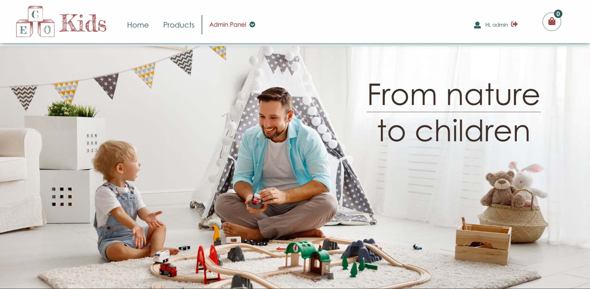

# Eco Kids



E-commerce website selling toys .

## Description

Website focusing on selling toys made from ecological and sustainable materials. The toys can be either new or used in a super good condition.

- By logging in as an admin you can add/edit/delete products.
- We give our best, so that the children will have the best to play with.
- The used toys are being evaluated from us before we put them on sale.
- The contact form can be used as an enquiry to sell a toy.

## Built With

- [Vanilla js](https://www.javascript.com/)
- [Bootstrap](https://getbootstrap.com)
- [Sass](https://sass-lang.com/)
- [Strapi](https://strapi.io/)
- [Cloudinary](https://cloudinary.com/)

## Getting Started

### Installing

1. Clone the repo:

```bash
git clone git@github.com:Fragki86/semester-project-2.git
```

OR

download [GitHub Desktop](https://desktop.github.com/) and clone it straight from the repository.

2. Install the dependencies:

```
npm install
```

3. Install following VS code extensions:

- Live Sass Compiler
- Live Server

### Running

1. Opening the project:
Click on
```
Go Live
```

And then
```
Watch Sass
```
on the bottom of the screen.

## Contributing

The project is open contribution, especially for backend developing. It would be nice to fulfil the payment method as well with a database. 
We would be glad to here also opinions and suggestions regarding the design and effects.
Make sure you open a pull request so that the code can be reviewed.

## Contact

You can find me also here:

[](https://www.facebook.com/giorgos.fragkias)      [](https://www.linkedin.com/in/georgios-fragkias-56026382/)      [](mailto:geo.fragkias@gmail.com)